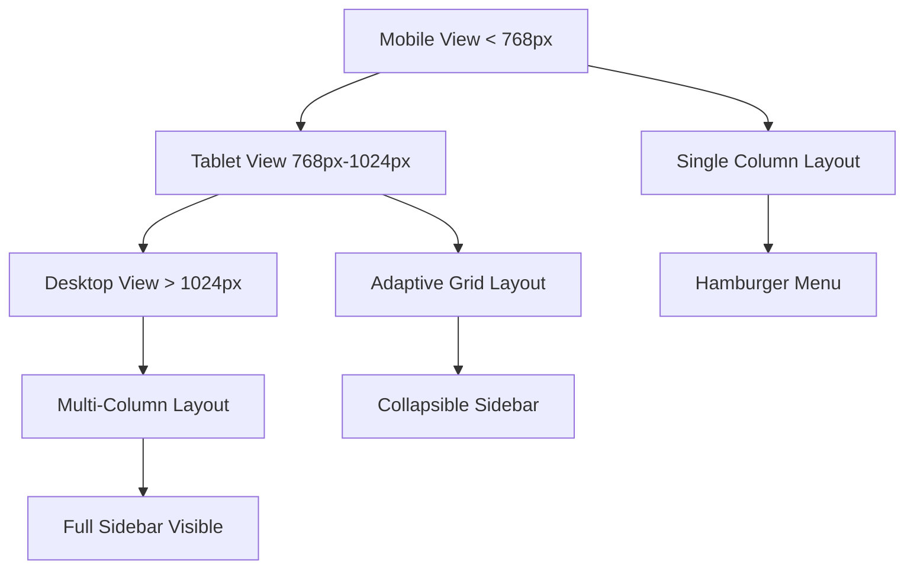

## 1. Product Overview
Excel Connect application ko fully responsive banana hai jo har device pe perfect kaam kare. Mobile, tablet, aur desktop pe consistent user experience provide karna hai.

- Problem: Current application mein responsive issues hain jaise sidebar mobile pe proper nahi khulta, header navigation mobile pe cluttered hai, aur content mobile pe readable nahi hai
- Target: Doctors, patients, aur marketers jo mobile aur tablet pe bhi app use karna chahte hain

## 2. Core Features

### 2.1 User Roles
| Role | Registration Method | Core Permissions |
|------|---------------------|------------------|
| Doctor | Email registration | Full dashboard access, mobile responsive interface |
| Client | Email registration | Mobile-first interface, appointment booking |
| Marketer | Email registration | Mobile responsive admin panel |

### 2.2 Feature Module
Responsive design requirements consist of following main areas:
1. **Mobile Navigation**: Hamburger menu, collapsible sidebar, touch-friendly buttons
2. **Tablet Layout**: Adaptive grid system, optimized touch targets, readable content
3. **Desktop Layout**: Full sidebar visibility, multi-column layouts, hover effects
4. **Cross-device Consistency**: Uniform colors, fonts, spacing across all breakpoints

### 2.3 Page Details
| Page Name | Module Name | Feature description |
|-----------|-------------|---------------------|
| Doctor Dashboard | Mobile Sidebar | 1024px se kam width pe hamburger menu show karna, sidebar ko slide-in animation ke saath open karna |
| Doctor Dashboard | Responsive Grid | 768px se kam pe single column, 768-1024px pe two columns, 1024px+ pe three columns |
| Doctor Header | Mobile Navigation | 768px se kam pe desktop navigation hide karke mobile menu show karna |
| All Pages | Touch Optimization | Mobile pe minimum 44px touch targets, proper spacing between clickable elements |
| All Pages | Content Scaling | Font sizes mobile pe 16px minimum, proper line heights aur readable content width |
| Login Pages | Mobile Forms | Form fields ko full width karna mobile pe, proper keyboard handling |
| Chat Pages | Mobile Chat Interface | Message bubbles ka proper sizing, input field ka easy access |

## 3. Core Process

### Mobile User Flow
Mobile pe user jo karega:
1. App open karega to responsive login page dikhega
2. Login ke baad mobile-optimized dashboard dikhega
3. Hamburger menu se navigation access kar sakega
4. All features mobile pe properly accessible honge

### Responsive Breakpoint Flow

## 4. User Interface Design

### 4.1 Design Style
- **Primary Colors**: #9AC63F (green), #111827 (dark gray)
- **Secondary Colors**: #6B7280 (medium gray), #F9FAFB (light gray)
- **Button Style**: Rounded corners (8px radius), proper padding (12px vertical, 24px horizontal)
- **Font**: Raleway font family, mobile pe 16px minimum, desktop pe 18px for body text
- **Layout Style**: Card-based design, proper shadows, consistent spacing (8px grid system)
- **Icon Style**: Lucide React icons, consistent 24px size mobile pe, 20px desktop pe

### 4.2 Page Design Overview
| Page Name | Module Name | UI Elements |
|-----------|-------------|-------------|
| Doctor Dashboard | Mobile Header | Logo: 125px mobile, 250px desktop; Hamburger menu: top-left, 44px touch target |
| Doctor Dashboard | Sidebar | Width: 256px fixed, mobile pe overlay with backdrop, smooth slide animation |
| Login Page | Mobile Form | Full width inputs, 16px font size, proper keyboard type (email, tel) |
| Chat Interface | Message Bubbles | Max-width: 70% mobile, 60% desktop; proper spacing between messages |
| Calendar View | Mobile Calendar | Single column view, large date buttons, swipe navigation |

### 4.3 Responsiveness
- **Desktop-First Approach**: Default styles desktop ke liye, phir mobile pe optimize karna
- **Breakpoints**: 640px (mobile), 768px (tablet), 1024px (desktop), 1280px (large desktop)
- **Touch Interaction**: Minimum 44px touch targets, proper hover/focus states
- **Performance**: Fast loading mobile pe, optimized images, proper lazy loading