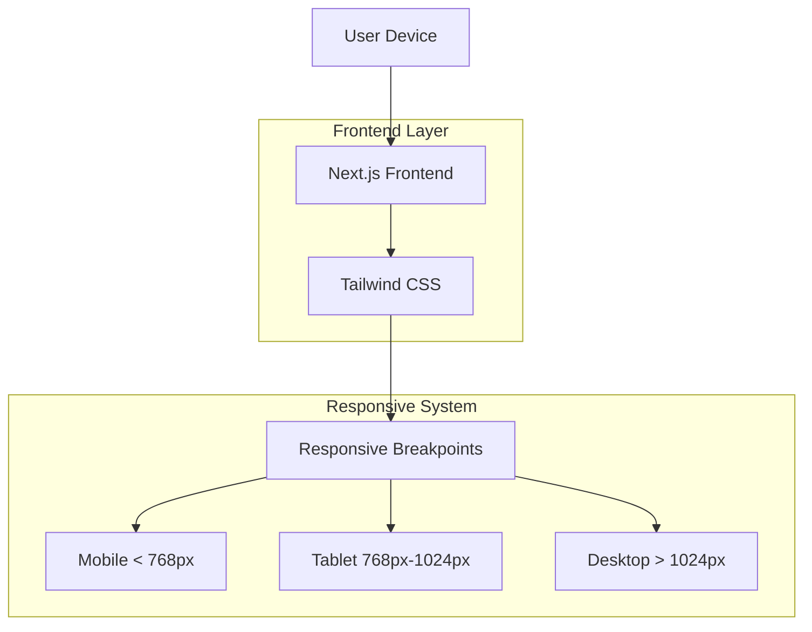
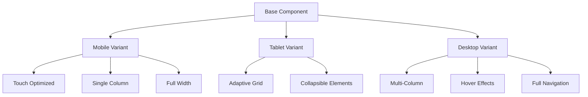

## 1. Architecture Design



## 2. Technology Description
- **Frontend**: Next.js@14 + React@18 + TypeScript
- **Styling**: Tailwind CSS@3 with custom responsive utilities
- **UI Components**: Custom shadcn/ui components with responsive variants
- **State Management**: React hooks for mobile menu state
- **Icons**: Lucide React with responsive sizing
- **Initialization Tool**: next-init (built-in with Next.js)

## 3. Route Definitions
| Route | Purpose | Responsive Features |
|-------|---------|-------------------|
| / | Home page - Doctor login | Mobile-optimized form layout |
| /doctor/dashboard | Doctor main dashboard | Collapsible sidebar, responsive grid |
| /doctor/patients | Client management | Mobile table views, card layouts |
| /doctor/schedule | Appointment calendar | Mobile calendar view, touch gestures |
| /doctor/messages | Chat interface | Mobile chat bubbles, full-screen mobile |
| /my-profile | Profile settings | Mobile form optimization |
| /patient/* | Client portal routes | Mobile-first design |
| /marketer/* | Marketer portal routes | Tablet-optimized layouts |

## 4. Responsive Breakpoint System

### 4.1 Core Breakpoints
```typescript
// tailwind.config.ts extensions
screens: {
  'xs': '475px',    // Extra small devices
  'sm': '640px',    // Small devices
  'md': '768px',    // Medium devices (tablets)
  'lg': '1024px',   // Large devices (desktops)
  'xl': '1280px',   // Extra large devices
  '2xl': '1536px',  // 2X large devices
}
```

### 4.2 Responsive Utilities
```typescript
// Custom responsive utilities
const responsiveUtils = {
  // Mobile-first approach
  mobile: '@media (max-width: 767px)',
  tablet: '@media (min-width: 768px) and (max-width: 1023px)',
  desktop: '@media (min-width: 1024px)',
  
  // Touch target sizes
  touchTarget: 'min-h-[44px] min-w-[44px]',
  mobileSpacing: 'space-y-4 px-4',
  desktopSpacing: 'space-y-6 px-6'
}
```

## 5. Component Architecture

### 5.1 Responsive Component Structure


### 5.2 Key Responsive Components

#### Sidebar Component
```typescript
interface ResponsiveSidebarProps {
  isMobile: boolean;
  isOpen: boolean;
  onToggle: () => void;
  breakpoint: 'md' | 'lg';
}

// Mobile: Overlay sidebar with backdrop
// Tablet: Collapsible sidebar
// Desktop: Fixed visible sidebar
```

#### Header Component
```typescript
interface ResponsiveHeaderProps {
  showMobileMenu: boolean;
  showDesktopNav: boolean;
  logoSize: 'small' | 'medium' | 'large';
}
```

#### Grid System
```typescript
interface ResponsiveGridProps {
  mobileCols: 1;
  tabletCols: 2;
  desktopCols: 3;
  gapSize: 'small' | 'medium' | 'large';
}
```

## 6. State Management for Responsive Behavior

### 6.1 Mobile Menu State
```typescript
const useResponsiveMenu = () => {
  const [isMobile, setIsMobile] = useState(false);
  const [isMenuOpen, setIsMenuOpen] = useState(false);
  
  useEffect(() => {
    const checkMobile = () => {
      setIsMobile(window.innerWidth < 1024);
      if (window.innerWidth >= 1024) {
        setIsMenuOpen(false); // Auto-close on desktop
      }
    };
    
    checkMobile();
    window.addEventListener('resize', checkMobile);
    return () => window.removeEventListener('resize', checkMobile);
  }, []);
  
  return { isMobile, isMenuOpen, setIsMenuOpen };
};
```

### 6.2 Responsive Layout State
```typescript
const useResponsiveLayout = () => {
  const [layout, setLayout] = useState<'mobile' | 'tablet' | 'desktop'>('desktop');
  
  useEffect(() => {
    const updateLayout = () => {
      const width = window.innerWidth;
      if (width < 768) setLayout('mobile');
      else if (width < 1024) setLayout('tablet');
      else setLayout('desktop');
    };
    
    updateLayout();
    window.addEventListener('resize', updateLayout);
    return () => window.removeEventListener('resize', updateLayout);
  }, []);
  
  return layout;
};
```

## 7. Performance Optimization

### 7.1 Image Optimization
```typescript
// Responsive images with Next.js
<Image
  src="/images/logo.svg"
  alt="Logo"
  width={layout === 'mobile' ? 125 : 250}
  height={layout === 'mobile' ? 16 : 32}
  priority={layout === 'desktop'} // Priority loading for desktop
  loading={layout === 'mobile' ? 'lazy' : 'eager'}
/>
```

### 7.2 Code Splitting
```typescript
// Dynamic imports for mobile-specific components
const MobileSidebar = dynamic(() => import('@/components/MobileSidebar'), {
  loading: () => <div>Loading...</div>,
  ssr: false // Client-side only for mobile detection
});
```

## 8. Testing Strategy

### 8.1 Responsive Testing Checklist
- [ ] All breakpoints pe proper layout
- [ ] Touch targets 44px+ on mobile
- [ ] Content readable without zoom on mobile
- [ ] No horizontal scrolling
- [ ] Proper keyboard navigation
- [ ] Images properly scaled
- [ ] Forms mobile-optimized
- [ ] Loading states responsive

### 8.2 Browser Compatibility
- Chrome (mobile & desktop)
- Safari (iOS & macOS)
- Firefox (all devices)
- Edge (Windows)
- Samsung Internet (Android)